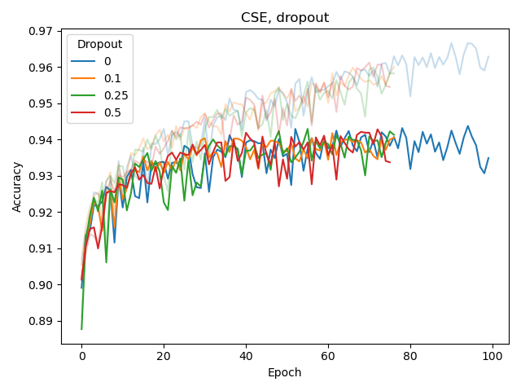
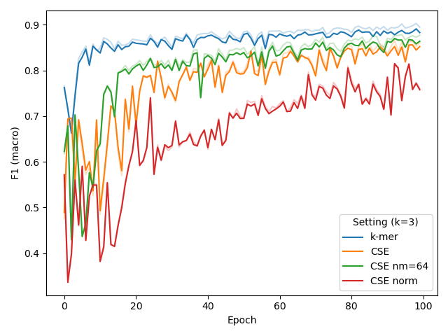

.. |bert_archs| image:: figures/hyppar_tuning/bert_architectures.png
    :width: 660

.. |warmup| image:: figures/hyppar_tuning/warmup.png
    :width: 300

.. |cls_wd_bpe| image:: figures/hyppar_tuning/finetune_wd_bpe.png
    :width: 300

.. |cls_wd_cse| image:: figures/hyppar_tuning/finetune_wd_cse.png
    :width: 300

.. |cls_dr_bpe| image:: figures/hyppar_tuning/finetune_dr_bpe.png
    :width: 300

.. |cse_linear| image:: figures/hyppar_tuning/cse_linear.png
    :width: 220

.. |cse_lin-rel_mlm| image:: figures/hyppar_tuning/cse_linear_relu_mlm.png
    :width: 220

.. |cse_lin-rel_cls| image:: figures/hyppar_tuning/cse_linear_relu_cls.png
    :width: 220

.. |cse_kernels| image:: figures/hyppar_tuning/cse_kernels.png
    :width: 220

.. |graph_abstr| image:: figures/graphical_abstract.jpg
    :width: 100%

Experiments
===========
This folder contains documentation and scripts of experiments that were 
conducted for `LncRNA-BERT: An RNA Language Model for Classifying Coding and 
Long Non-Coding RNA <https://doi.org/10.1101/2025.01.09.632168>`_.

.. experiments start

|graph_abstr|

Main Experiments
----------------
In our `paper <https://doi.org/10.1101/2025.01.09.632168>`_, we carry out 
experiments that compare different pre-training data configurations as well as 
different encoding methods. Scripts to reproduce these experiments can be found
in the `experiments 
<https://github.com/luukromeijn/lncRNA-Py/tree/master/experiments>`_ folder in 
our repository. This folder also contains scripts for training the final 
lncRNA-BERT models (with 3-mer tokenization or Convolutional Sequence Encoding).
Note that each of these bash scripts call upon the regular Python `scripts 
<scripts.html>`_ that 
are part of the ``lncrnapy`` package.

Hyperparameter Tuning
---------------------
Hyperparameter tuning was carried out at several stages during the development of lncRNA-BERT. 
Here, we aim to provide a clear overview of the settings that were experimented with and the decisions that were made. 
The results are subject to improvements that were made in lncRNA-BERT's implementation, as well as minor differences datasets utilized throughout development.
The described experiments below are targeted towards allowing a fair comparisons between pre-training data, encoding methods, and other NLMs, as reported in our paper.
Nevertheless, we acknowledge that lncRNA-BERT's performance can likely be improved with additional tuning. 
We report hyperparameters with their appropriate ``names``, such that experiments can be repeated by using lncRNA-Py's scripts.

BERT configuration
^^^^^^^^^^^^^^^^^^
We experimented with the following architecture parameters of BERT, for pre-training, using BPE with ``vocab_size`` 256 and 4096:

- Transformer blocks (``N``): 6, 8, 10, 12, 16
- Dimensionality (``d_model``): 256, 512, 1024 

In total, this yields 2*5*3=30 configurations. The graphs in the visualizations below represent the average for each hyperparameter value (see legend), while the bands around the graphs represent the minimum and maximum performance for all settings, given that specific hyperparameter value. 

|bert_archs|

Larger values for ``d_model`` and ``N`` lead to increased MLM accuracy.
The figure indicates that for ``vocab_size``, 4096 requires a larger model than 256. 
Moreover, ``d_model`` is shown to be more impactful than ``N``.

Ultimately, we chose to adopt BERT-medium's settings, mainly to ensure a fair comparison to methods like DNABERT-2, BiRNA-BERT, and GENA-LM, which use a similar configuration.
This configuration uses a relatively large dimensionality (``d_model=768``), which was shown to be beneficial, while setting its number of transformer blocks to a not-so-extreme value (``N=12``).

Masked Language Modeling
^^^^^^^^^^^^^^^^^^^^^^^^
For MLM, we set ``warmup_steps=32000`` and ``batch_size=8``. The experiments that led to this conclusion are reported here, using model (``N=6, d_model=256``) and BPE with ``vocab_size=4096``.
MLM accuracy (% of correctly predicted masked tokens) is reported on the y-axis.

|warmup| |bpe_bs|

While our choice for ``warmup_steps`` (while using ``batch_size=8``) is obvious from the figure , deciding ``batch_size=8`` was motivated by a previous experiment as well as compute limitations, rather than these results. 
Specifically, our BERT configuration experiment pointed out that using a larger model is beneficial for performance, much more beneficial than the effect of ``batch_size``, shown above.
Unfortunately, using large models in combinations with large batch sizes is computationally demanding, as it requires significant GPU memory.
Hence, we chose to prioritize model size over batch size here, setting ``batch_size=8`` to save computational expenses for other experiments.

We repeated the experiment for a larger model (``N=12, d_model=1024``) with CSE in a much later development stage, confirming that ``batch_size`` still only had limited effect.
|cse_bs|

Classification
^^^^^^^^^^^^^^
For the fine-tuning task, we initially set learning rate (lr) ``learning_rate=1e-05`` based on an experiment (below, left) with BPE ``vocab_size=4096``, and later confirmed that this setting was also
appropriate for BERT-medium in combination with BPE or CSE (below, middle), also when training from scratch (instead of fine-tuning a pre-trained model, for CSE, below, right). 
This more recent experiment also included several batch sizes (bs), for which ``batch_size=8`` was found to be best (also identified at an earlier stage but not reported here).

|cls_lr_bpe| |cls_lr_new| |cls_lr_scratch| 

We also experimented with the ``weight_decay`` hyperparameter of Adam as well as adding a dropout layer before the classification (sigmoid) output layer, both for BPE and CSE.
None of these seemed to improve classification or reduce overfitting. The latter (overfitting) was assessed by considering the difference between training and validation performance, with training performance plotted as a lighter-colored curve. 

|cls_wd_bpe| |cls_wd_cse|
|cls_dr_bpe| |cls_dr_cse| 

Finally, for the probing the network with a tiny MLP (256 hidden nodes), we found that a learning rate of 0.0001 was more appropriate.

|cls_lr_prb|

Convolutional Sequence Encoding
^^^^^^^^^^^^^^^^^^^^^^^^^^^^^^^
We experimented with several architectural changes for the CSE component during its development, while using BERT-medium as base architecture. 
Based on the left plot below, we conclude that adding a linear layer before the final MLM output layer helps the model, while adding an extra linear (embedding) layer after the convolution in the input does not.
The input CSE layer is further experimented with in the middle and right plot, which shows that ReLU-activating the convolution (but not linearly transforming it) helps for CSE with larger k (in this case, 9).

|cse_linear| |cse_lin-rel_mlm| |cse_lin-rel_cls| 

While linearly transforming the convolved embeddings in the input layer was shown to have a negative affect, it did allow us to set the number of kernels to a value other than ``d_model``. 
Hence, we experimented with several different number of kernels in the CSE, and then transforming the output to ``d_model`` dimensions with a linear layer. 
Our results (left plot) indicate that adding more kernels does not benefit performance. Adding too many kernels can even deteroriate performance. 
We also experimented whether masking out multiple consecutive nucleotides (defined by the ``mask_size`` hyperparameter, similar to SPAN-BERT) would improve pre-training (middle plot). This was not the case. In fact, we found that a model pre-trained with a mask size of 1 would perform better at predicting multiple masked nucleotides than a model pre-trained with mask size of 2.
In a final attempt to increase CSE's performance for short ``k``, (i.e. 3), we tried adding layer normalization after convolution or significantly reducing the number of kernels to 64, but this did not help (right plot).

|cse_kernels| |cse_mask_sizes| |cse_tryouts|